# Content Research Crew

[](https://www.python.org/)
[](https://crewai.com)
[](LICENSE)

An intelligent multi-agent AI system that creates comprehensive research guides on any topic using crewAI's powerful framework. The system leverages specialized AI agents that collaborate to research, write, and review content, producing structured markdown guides with detailed sections, examples, and practical applications.

## 🚀 Features

- **Multi-Agent Collaboration**: Content writer and reviewer agents work together to ensure quality
- **Flexible Topic Coverage**: Generate guides on any subject for different audience levels (beginner/intermediate/advanced)
- **Structured Output**: Produces well-organized markdown guides with introductions, sections, and conclusions
- **Interactive Flow**: Step-by-step guide creation process with user input
- **Configurable Agents**: Easily customize agent roles, goals, and tasks through YAML configuration
- **Flow Visualization**: Generate interactive flow diagrams to understand the process

## 🏗️ System Architecture

The system operates through three main phases:

### 1. User Input Phase
- Collect topic and target audience level from user
- Validate input and prepare for guide creation

### 2. Outline Creation Phase
- Use LLM to generate structured guide outline
- Create title, introduction, sections, and conclusion
- Save outline as JSON for reference

### 3. Content Creation Phase
- Content Writer Agent creates detailed sections
- Content Reviewer Agent ensures quality and consistency
- Sequential processing maintains flow and coherence
- Compile final guide in markdown format



## 📋 Prerequisites

- Python 3.10 or higher
- OpenAI API key (for LLM functionality)
- UV package manager (recommended)

## 🛠️ Installation

### Using UV (Recommended)

1. **Install UV**:
   ```bash
   pip install uv
   ```

2. **Clone the repository**:
   ```bash
   git clone <repository-url>
   cd content-research-crew
   ```

3. **Install dependencies**:
   ```bash
   uv sync
   ```

### Using Conda

1. **Create environment**:
   ```bash
   conda create -p venv python==3.11
   conda activate venv/
   ```

2. **Install dependencies**:
   ```bash
   pip install crewai crewai-tools
   pip install -e .
   ```

## ⚙️ Configuration

### Environment Setup

1. **Create `.env` file** in the project root:
   ```bash
   cp .env.example .env
   ```

2. **Add your OpenAI API key** to `.env`:
   ```
   OPENAI_API_KEY=your_api_key_here
   ```

### Agent Configuration

Customize agent behavior by modifying the YAML files in `src/researcher_content/crews/content_crew/config/`:

- **`agents.yaml`**: Define agent roles, goals, and LLM models
- **`tasks.yaml`**: Configure writing and reviewing tasks with detailed instructions

Example agent configuration:
```yaml
content_writer:
  role: "Educational Content Writer"
  goal: "Create engaging, informative content that thoroughly explains the assigned topic"
  backstory: "You are a talented educational writer with expertise in creating clear, engaging content..."
  llm: openai/gpt-4o-mini
```

## 🚀 Usage

### Running the Guide Creator

1. **Start the application**:
   ```bash
   uv run kickoff
   ```

2. **Follow the prompts**:
   - Enter your desired topic
   - Select audience level (beginner/intermediate/advanced)

3. **View the results**:
   - Guide outline: `output/guide_outline.json`
   - Complete guide: `output/complete_guide.md`

### Generating Flow Visualization

Create an interactive visualization of the flow:
```bash
uv run plot
```

This generates `guide_creator_flow.html` for viewing the flow diagram.

## 🤖 Understanding the Agents

### Content Writer Agent
- **Role**: Creates comprehensive, engaging content sections
- **Focus**: Educational value, clarity, and practical examples
- **Output**: Well-structured markdown sections with 500-800 words each

### Content Reviewer Agent
- **Role**: Ensures content quality and consistency
- **Focus**: Accuracy, coherence, and alignment with previous sections
- **Output**: Polished, improved versions of written content

## 📁 Project Structure

```
content-research-crew/
├── src/researcher_content/
│   ├── main.py                    # Main flow implementation
│   ├── crews/
│   │   └── content_crew/
│   │       ├── content_crew.py    # Crew definition
│   │       └── config/
│   │           ├── agents.yaml    # Agent configurations
│   │           └── tasks.yaml     # Task definitions
│   └── tools/
│       └── custom_tool.py         # Custom tools (placeholder)
├── output/
│   ├── complete_guide.md          # Generated guide
│   └── guide_outline.json         # Guide structure
├── docs/
│   └── images/
│       └── flow_diagram.svg       # Flow visualization
├── pyproject.toml                 # Project configuration
├── uv.lock                        # Dependency lock file
└── README.md                      # This file
```

## 🔧 Development

### Extending the System

1. **Add New Agents**:
   - Create new agent definitions in `agents.yaml`
   - Implement agent logic in the crew file

2. **Create Custom Tasks**:
   - Define new tasks in `tasks.yaml`
   - Update the crew to include new tasks

3. **Add Custom Tools**:
   - Implement tools in `src/researcher_content/tools/`
   - Register tools with agents in the crew

### Example: Adding a Research Agent

```yaml
# In agents.yaml
research_agent:
  role: "Research Specialist"
  goal: "Gather and analyze relevant information for the topic"
  backstory: "You are an expert researcher with access to vast knowledge..."
  llm: openai/gpt-4o-mini
```

## 📊 Output Examples

The system generates comprehensive guides like:

- **Guide Outline** (JSON): Structured outline with sections and descriptions
- **Complete Guide** (Markdown): Full guide with:
  - Professional introduction
  - Detailed content sections
  - Practical examples and exercises
  - Summary conclusions

## 🤝 Contributing

1. Fork the repository
2. Create a feature branch (`git checkout -b feature/amazing-feature`)
3. Commit your changes (`git commit -m 'Add amazing feature'`)
4. Push to the branch (`git push origin feature/amazing-feature`)
5. Open a Pull Request

## 📚 Resources

- [crewAI Documentation](https://docs.crewai.com)
- [OpenAI API Reference](https://platform.openai.com/docs)
- [UV Package Manager](https://docs.astral.sh/uv/)

## 🆘 Support

- **Issues**: [GitHub Issues](https://github.com/your-username/content-research-crew/issues)
- **Documentation**: [crewAI Docs](https://docs.crewai.com)
- **Community**: [crewAI Discord](https://discord.com/invite/X4JWnZnxPb)

## 📄 License

This project is licensed under the MIT License - see the [LICENSE](LICENSE) file for details.

---

**Made with ❤️ using [crewAI](https://crewai.com)**
